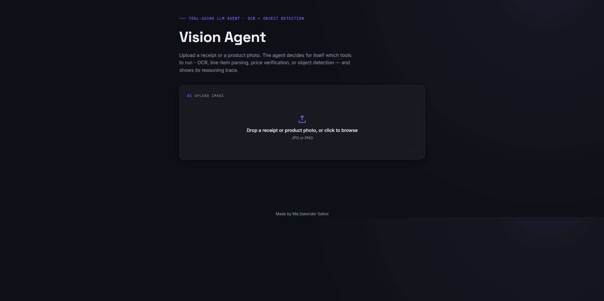
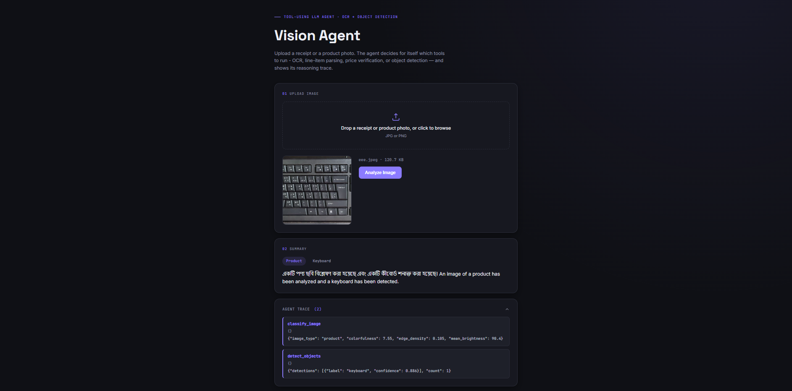
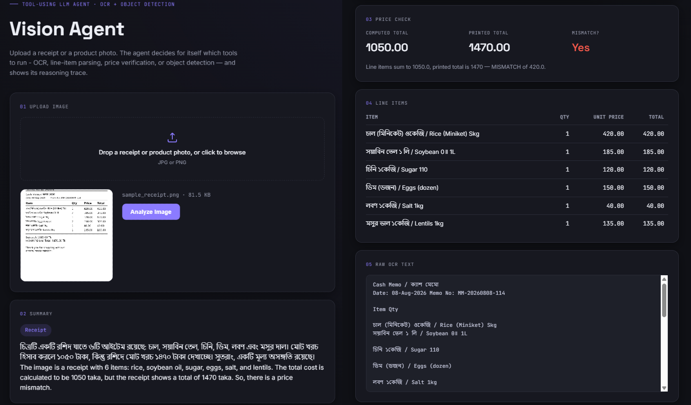
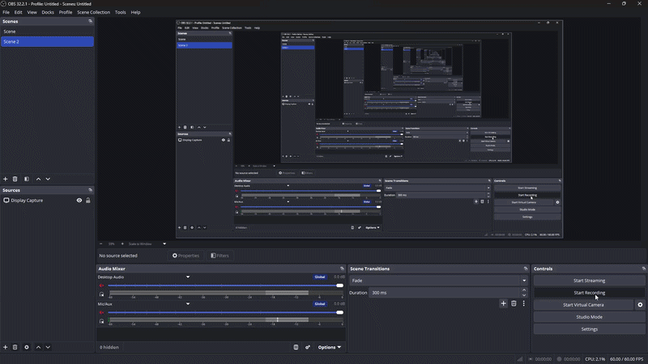

# Vision Agent — Multi-Modal Receipt & Product Analyzer

**A tool-using LLM agent that combines computer vision (OCR + object detection) with an LLM that
decides, on its own, which tool to call and when — receipts get parsed, verified, and
fact-checked; product photos get identified.**


-F55036)


---

## Table of Contents

- [Why this is agentic, not just "OCR → LLM"](#why-this-is-agentic-not-just-ocr--llm)
- [Demo / Screenshots](#demo--screenshots)
- [Tools available to the agent](#tools-available-to-the-agent)
- [Tech Stack](#tech-stack)
- [Frontend](#frontend)
- [API Reference](#api-reference)
- [Project Layout](#project-layout)
- [Quickstart](#quickstart)
- [Docker](#docker)
- [Engineering Challenges & Solutions](#engineering-challenges--solutions)
- [Honesty About Scope](#honesty-about-scope)

---

## Why this is agentic, not just "OCR → LLM"

The LLM is given a small set of **tools** (functions) and a system prompt describing the task. It
decides the sequence itself via OpenAI-style function calling (Groq supports this natively) —
there's no hardcoded `if receipt: do X` branching in the application code.

```
User uploads an image
        │
        ▼
┌───────────────────────┐
│   Tool-Calling Agent    │◀──────────────┐
│   (LLM decides what      │                │
│   to do next)             │                │
└──────────┬─────────────┘                │
           │ picks a tool                   │
           ▼                                 │
   ┌────────────────┐   result   ┌──────────┴─────────┐
   │  run the tool     │──────────▶│ feed result back      │
   │  (ocr_receipt,    │           │  to the LLM             │
   │  detect_objects,  │           └────────────────────────┘
   │  check_price_     │
   │  mismatch,        │
   │  classify_image)  │
   └────────────────┘
           │
           ▼ (LLM decides it has enough info)
   Final natural-language answer / report
```

A typical trace for a receipt image:
1. LLM sees an image was uploaded → calls `classify_image` to check "receipt vs. product photo".
2. Result: "receipt" → LLM calls `ocr_receipt` (OpenCV preprocessing + Tesseract OCR, bilingual).
3. LLM calls `parse_line_items` on the raw OCR text to get structured `{item, qty, price}` rows.
4. LLM calls `check_price_mismatch` (deterministic Python — sums line items, compares to the
   printed total) to catch billing errors without relying on the LLM's arithmetic.
5. LLM writes the final summary/report in natural language, flagging any mismatch found.

For a plain product photo, the LLM instead calls `detect_objects` (YOLOv8) and summarizes what's
in the image.

---

## Demo / Screenshots

| Landing | Product detection | Receipt + price mismatch caught |
|---|---|---|
|  |  |  |

> The third example is the one that matters most — it shows `check_price_mismatch` actually
> catching a billing discrepancy between the line items and the printed total, not just
> extracting text.

## Demo GIF



 [](https://saikot313.github.io/Vision-Agent---Multi-Modal-Receipt-Product-Analyzer/)


---

## Tools available to the agent

| Tool | Type | What it does |
|---|---|---|
| `classify_image` | CV (heuristic + OpenCV) | Receipt/document vs. generic product photo |
| `ocr_receipt` | CV (OpenCV + Tesseract) | Deskew/threshold + bilingual (Bangla/English) OCR |
| `parse_line_items` | LLM sub-call | Turns raw, noisy OCR text into structured item rows |
| `check_price_mismatch` | Deterministic Python | Sums parsed line items, compares to the printed total — **not** LLM arithmetic, so the result is reliable and auditable |
| `detect_objects` | CV (YOLOv8, pretrained COCO) | Bounding boxes + labels for product images |

All tools live in `app/tools/` as plain Python functions with a JSON-schema description attached
— see `app/tools/registry.py`. Adding a new tool means writing one function + one schema entry,
nothing else changes.

---

## Tech Stack

| Layer | Choice |
|---|---|
| Backend API | FastAPI |
| Computer vision | OpenCV (deskew, adaptive threshold, contrast normalization) |
| OCR | Tesseract (`pytesseract`), `ben+eng` bilingual mode |
| Object detection | YOLOv8 (`ultralytics`, pretrained on COCO) |
| LLM / tool-calling | Groq API (Llama 3.x) |
| Frontend | Vanilla HTML / CSS / JS, served directly by FastAPI (no build step) — plus a Streamlit demo UI as an alternative |
| Deployment | Docker + docker-compose |

---

## Frontend

A single-page UI is served directly by FastAPI at `/` (files in [`app/static/`](app/static/) —
`index.html`, `style.css`, `script.js`, no build step or framework needed):

- Drag-and-drop image upload with a live preview and a scanning-line animation while the agent
  is reasoning.
- A results view with the image-type badge, detected-object chips, a price-check card
  (computed vs. printed total, mismatch flagged in red), a line-items table, the raw OCR text,
  and a collapsible **agent trace** showing every tool call in order.

A Streamlit UI (`streamlit_app.py`) is also included as a lighter-weight alternative for quick
local demos.

---

## API Reference

| Method | Endpoint | Description |
|---|---|---|
| `GET` | `/` | Serves the web UI |
| `POST` | `/analyze` | Upload an image; runs the full tool-calling agent and returns a structured analysis |
| `GET` | `/health` | Health check |
| `GET` | `/docs` | Interactive Swagger API docs (auto-generated by FastAPI) |

```bash
curl -X POST http://localhost:8000/analyze \
  -F "image=@sample_data/receipt.jpg"
```

Full request/response schema is in [`app/schemas.py`](app/schemas.py) (`AnalyzeResponse`:
`image_type`, `ocr_text`, `line_items`, `price_check`, `detected_objects`, `summary`,
`agent_trace`).

---

## Project Layout

```
multimodal-invoice-agent/
├── app/
│   ├── config.py
│   ├── schemas.py
│   ├── main.py                    # FastAPI: /, /analyze, /health
│   ├── static/                    # self-hosted frontend
│   │   ├── index.html
│   │   ├── style.css
│   │   └── script.js
│   ├── agent/
│   │   ├── tool_agent.py          # the tool-calling loop
│   │   └── llm_client.py          # Groq client (tool-calling enabled)
│   ├── tools/
│   │   ├── registry.py            # tool schemas + dispatch table
│   │   ├── classify_image.py
│   │   ├── ocr_tool.py
│   │   ├── line_item_parser.py
│   │   ├── price_check_tool.py
│   │   └── object_detection.py
│   └── core/
│       └── image_preprocessing.py # OpenCV deskew/threshold helpers
├── streamlit_app.py                # Streamlit demo UI (alternative to app/static/)
├── sample_data/
├── screenshots/                    # README images/GIF
├── tests/
│   └── test_basic.py               # tests deterministic tools, no API/model needed
├── requirements.txt
├── Dockerfile
├── docker-compose.yml
├── .env.example
└── README.md
```

---

## Quickstart

```bash
# system dependency: tesseract + bangla language pack
sudo apt-get install -y tesseract-ocr tesseract-ocr-ben
# Windows: install from https://github.com/UB-Mannheim/tesseract/wiki, then set
# TESSERACT_CMD_PATH in .env if tesseract isn't on PATH

cp .env.example .env
# add your free GROQ_API_KEY (https://console.groq.com)

pip install -r requirements.txt

# Web UI (FastAPI-served) + API
uvicorn app.main:app --reload --port 8000
# open http://localhost:8000

# OR the Streamlit demo UI
streamlit run streamlit_app.py
```

---

## Docker

```bash
docker-compose up --build
```

> On Windows, leave `TESSERACT_CMD_PATH` **blank** in `.env` when running via Docker — the
> container is Linux and already has Tesseract on `PATH` (installed in the `Dockerfile`); a
> Windows path there will break OCR inside the container. Only set it for a local, non-Docker
> Windows run.

---

## Engineering Challenges & Solutions

- **LLM-returned JSON wrapped in markdown fences** — `parse_line_items` asks the LLM for raw
  JSON, but models frequently wrap it in ` ```json ... ``` ` anyway, which broke `json.loads`
  and silently returned an empty item list. Fixed by stripping code fences before parsing, and
  surfacing the raw LLM output in the trace on a genuine parse failure instead of failing silently.
- **Empty final answer from the LLM** — in rare tool-calling edge cases the model returns no
  more tool calls but also empty `content`, which used to render as a blank result with no
  indication anything went wrong. Fixed with a fallback that builds a plain-text summary from
  whatever tool outputs were already collected.
- **`"null"` as a literal tool-call argument** — some models emit the JSON literal `null` (not
  `{}`) for tools that take no arguments; `json.loads("null")` returns `None`, which then failed
  Pydantic validation on the trace log. Fixed by normalizing any non-dict parse result to `{}`.
- **Dependency version drift breaking the Groq client** — `groq==0.11.0`'s internal HTTP client
  passes a `proxies` kwarg that newer `httpx` releases removed, causing a `TypeError` at client
  construction. Fixed by pinning `httpx==0.27.2` in `requirements.txt` — the same fix has to be
  reflected in the pinned file itself, not just installed locally, or a fresh `pip install` (or a
  Docker rebuild) reintroduces the break.
- **Cross-platform Tesseract discovery** — on Linux/Docker, `pytesseract` finds `tesseract` on
  `PATH` automatically; on Windows it usually isn't there. Added an explicit
  `TESSERACT_CMD_PATH` setting (used only if set) plus a clear, actionable error message
  (`TesseractNotFoundError` → install instructions) instead of a generic tool failure.
- **OCR imperfection propagating downstream** — on a real (if synthetic) bilingual receipt, OCR
  occasionally misreads a quantity column, which then produces an internally inconsistent line
  item (e.g. `quantity: 1` but a `line_total` that implies `quantity: 2`). `check_price_mismatch`
  still catches the resulting total discrepancy — a good illustration of why the arithmetic is
  done in plain Python and not left to the LLM.

---

## Honesty About Scope

- YOLOv8 here uses **pretrained COCO weights** (generic object classes) — not fine-tuned on
  Bangladeshi products/receipts specifically. Fine-tuning needs a labeled dataset + GPU, which is
  the natural "next step" to mention in an interview, not something faked here.
- `check_price_mismatch` is deliberately **not** left to the LLM — arithmetic is done in plain
  Python so the mismatch detection is reliable and auditable, and the LLM only explains the
  result in natural language. This is a good talking point: knowing *when not* to trust the LLM.
- OCR accuracy on real crumpled/handwritten receipts will be imperfect — that's expected and
  worth mentioning; the pipeline is structured so a better OCR engine (e.g. a Bangla-specific OCR
  model) can be swapped into `ocr_tool.py` without touching the agent logic.
